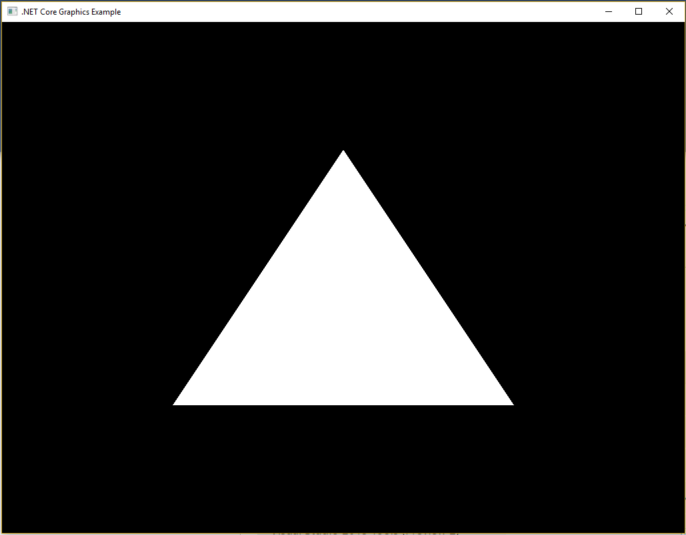

# Cross-Platform Triangle in .NET Core

Makes use of OpenGL and GLFW.

To try this out:

1. Download .Net Core Preview 4 https://github.com/dotnet/core/blob/master/release-notes/preview4-download.md
2. Clone this repo and run `dotnet restore` and `dotnet run`

If it all worked you should see the following:

